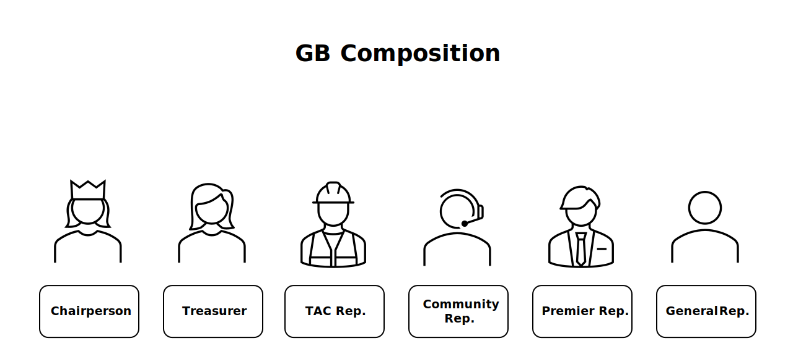
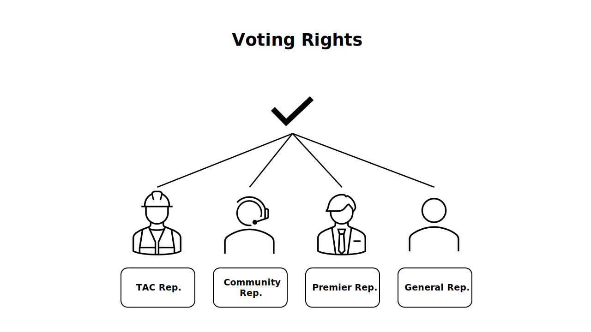

# Governing Board

The Governing Board (GB) represents the strategic leadership of NeoNephos. Within it decisions are made regarding the future of the foundation and the technical projects contained within.

The specific responsibilities are set in the [foundational project charter](https://cdn.platform.linuxfoundation.org/agreements/neonephos-foundation.pdf?__hstc=81619592.b399ecdf5f859a9f55ff3dc8bf8218d5.1748238689615.1750404125102.1750409856266.57&__hssc=81619592.1.1750409856266&__hsfp=2785804087), but they include

- Approving and allocating budgets.
- Approving new projects recommended by TAC.
- Overseeing Directed Fund business and community outreach matters.
- Collaborating with the LFEU on legal issues.
- Adopting and maintaining policies, rules, and procedures for the Directed Fund (subject to LFEU approval).
- Establishing advisory bodies, committees, programs, or councils 
- Creating conformance programs and soliciting input from the applicable governance body of any Technical Project.
- Voting on all decisions or matters that come before the Governing Board.

## Composition

The Governing Board may elect to create new roles at will. The following are the most fundamental ones as also defined in the [foundational project charter](https://cdn.platform.linuxfoundation.org/agreements/neonephos-foundation.pdf?__hstc=81619592.b399ecdf5f859a9f55ff3dc8bf8218d5.1748238689615.1750404125102.1750409856266.57&__hssc=81619592.1.1750409856266&__hsfp=2785804087).

### Chairperson

The Chairperson manages day-to-day operational decisions and presides over Governing Board Meetings.
Formally, the Chairperson is called *an officer* of the GB. The Chairperson is elected by the other voting GB Representatives. To be eligible as Chairperson a GB Representative position with voting rights is required. 

### Premier Representative

Each [Premier Member](../misc/membership_introduction.md) has a dedicated voting GB Representative.

### General Representative

For every five [General Members](../misc/membership_introduction.md) a shared voting GB Representative seat is created.

### TAC Representative

The TAC Representative is the liason between the GB and [TAC](../technical_advisory_council/technical_advisory_council_introduction.md). The TAC Representative has the right to vote in the GB.

### Community Representative

In order to honor organizations with exceptional contributions to the foundation's technical projects, one representative individual may be promoted by the GB for a one-year term in the GB. The Community Representative has the right to vote in the GB.

### Treasurer

The Treasurer prepares budgets for the Governing Board and monitors expenses. Contrary to some other foundations the Treasurer in NeoNephos is not the Chairperson of the Budget Committee, as the latter does not exist in NeoNephos. Additionally, the treasurer position does currently also not exist in NeoNephos.

## Voting

Votes in the Governing Board are usually simple majority votes. Some exceptions defined the the charter may require supermajority voting. If a vote is to be conducted during a meeting, then at least 50% of GB Representatives with voting rights must be present to reach quorum. If votes are conducted asynchronously (e.g. a poll that can be voted on for multiple days) then at least 50% of eligible GB Representatives must have cast a vote.

| Roles with Voting Rights |
|--|
| Premier Representative |
| General Representative |
| TAC Representative |
| Community Representative |

## One Representative per Sponsor

As the [foundational project charter](https://cdn.platform.linuxfoundation.org/agreements/neonephos-foundation.pdf?__hstc=81619592.b399ecdf5f859a9f55ff3dc8bf8218d5.1748238689615.1750404125102.1750409856266.57&__hssc=81619592.1.1750409856266&__hsfp=2785804087) describes, no organization can appoint more than one representative to the Governing Board. The only way a single company can have two representatives on the board is if this company also provides the TAC Representative. The charter also defines that this rule is also valid for all sub- and parent companies of the member organization. This means if Company B is a subcorporation of Company A, both will still share a single representative in the Governing Board.

## Meetings

The NeoNephos Governing Board meetings are generally private. This means, only GB representatives, LFEU staff or invited guests may attend the meetings.

## I am a Contributor. What does the GB do for me?

The Governing Board ensures that the technical projects you contribute to obtain the necessary resources needed in order to advance their goals. Without the Governing Board the project would have to come up itself with infrastructure support, community management, outreach efforts, direct financial support and more. A strong Governing Board ensures a strong support network for your project.
As contributor, the Governing Board member you might cross paths with is the TAC Representative. The TAC Representative is the GB's technical liaison who actively engages with projects via e.g. [TAC meetings](../technical_advisory_council/technical_advisory_council_introduction.md).

## Further Reading

The [NeoNephos Project Charter](https://cdn.platform.linuxfoundation.org/agreements/neonephos-foundation.pdf?__hstc=81619592.b399ecdf5f859a9f55ff3dc8bf8218d5.1748238689615.1750404125102.1750409856266.57&__hssc=81619592.1.1750409856266&__hsfp=2785804087) is the reference documentation regarding the Governing Board.
