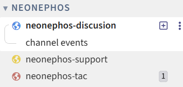
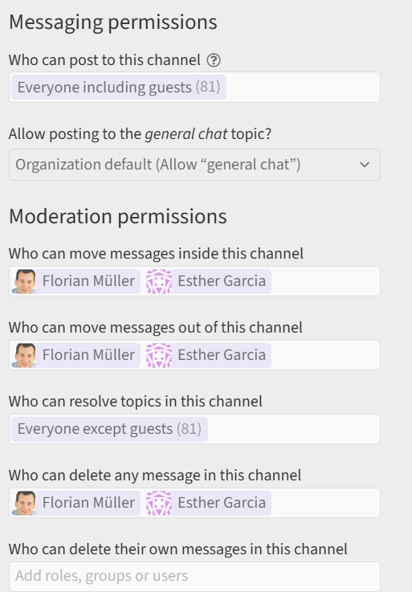
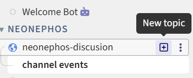

# Zulip Guidelines

Zulip serves as the primary hub of fostering live communication between NeoNephos, its technical projects and the community at large.

> [!IMPORTANT]  
> Please ensure you always follow the [NeoNephos Code of Conduct](https://github.com/neonephos/.github).

> [!NOTE]
> This document contains NeoNephos specific Zulip guidelines. To learn about Zulip itself such as terminology like [channels/streams](https://linuxfoundation.zulipchat.com/help/create-channels) or [topics](https://linuxfoundation.zulipchat.com/help/introduction-to-topics) consult the official documentation available [here](https://linuxfoundation.zulipchat.com/help/).

## Scope

> [!NOTE]  
> All NeoNephos related Zulip functionality is provided by the Linux Foundation and available at [https://linuxfoundation.zulipchat.com](https://linuxfoundation.zulipchat.com).

### What Belongs On Zulip

* General, public discussion about the foundation or a project.
* Public points of contact of councils such as of the Technical Steering Committee.
* Point of support for users of a project.
* Internal discussion of private committees such as the Governing Board.

### What Does Not Belong On Zulip

* Conversations that require an intamperable conversation log.
* Conversations that require the data to be stored and processed in a specific region such as the European Union.
* Conversations that require confidentiality.

> [!CAUTION]  
> As the Zulip instance is not self hosted but provided by the Linux Foundation, NeoNephos can give not give any guarantees on the locality nor processing or visibility of data.

## Channels

Zulip channels organize conversations based on *who* needs to see them. There are a few guidelines and best practices to follow when creating, using and moderating channels which are listed in this chapter.

> [!NOTE]  
> Zulip channels organize conversations based on the intended audience. This makes them different from e.g. Discord channels, which [organize conversations based on topics](https://discord.com/safety/360044149331-what-is-discord). While these two definitions in practice sometimes overlap, they are not the same. For thematic discrimination, Zulip offers the [topics](https://linuxfoundation.zulipchat.com/help/introduction-to-topics) feature.

### How To Add A Channel

After admission, every NeoNephos project will be set up by the Technical Advisory Council (TAC) with the following default set of channels:

| Channel  | Visibility | Purpose |
| -------- | ------- | ------- | 
|  *projectName*-discussion | public    | General discussion of the project|
|  *projectName*-tsc | public    | Technical Steering Committee contact avenue of the project|
|  *projectName*-tsc | private    | Technical Steering Committee private discussion|
|  *projectName*-support | public    | Support platform of the project|

> [!NOTE]  
> All *public* NeoNephos Zulip Channels are accessible and can be viewed without an account through the browser.

#### How To Request Additional Channels

Through the use of [topics](https://linuxfoundation.zulipchat.com/help/introduction-to-topics) the default channels should suffice for the majority of projects. Nevertheless, there may be reasons to have additional channels for e.g. security/vulnerability discussions. The procedure to add an additional channel is for the TSC Chairperson to nofity the TAC Chairperson of the intend to create a new channel for the project. The TAC Chairperson will then open an LF-internal ticket, requesting the new channel.

### Channel Settings

All new channels are initialized according to the default Linux Foundation Zulip policy.

| Type  | Configuration Value |
| -------- | ------- |
|  Message Retention Period  | Organization Default    |
| Allow Posting To The General Chat Topic? | Organization Default |
| Who Can Administer A Channel | Owners, Administrators, Moderators, LF PMO |
| Channel Folder | neonephos |
| Channel Description | *Will Be Set By LF* |

### Moderation Permissions

By default, the moderation role assignments are as such:

| Type  | Who Gets Moderation Rights |
| -------- | ------- |
|  NeoNephos Foundation Channels | TAC Chairperson, NeoNephos Community Managers, LF PMO    |
|  TAC Channels | TAC Chairperson, NeoNephos Community Managers, LF PMO    |
|  Governing Board Channels | GB Chairperson, TAC Chairperson, LF PMO    |
|  Project Channels | TSC Chairperson, TAC Chairperson, NeoNephos Community Managers, LF PMO    |

> [!NOTE]  
> The moderation privileges are channel scoped only. They do not allow the creation of new channels. For that the LF PMO must be contacted.

## Zulip Do's And Don'ts

### Don'ts

#### Offensive Content

Obviously nefarious content is already prohibited by our [Code of Conduct](https://neonephos.org/.github). Due to the sensitive, often political, nature of discussions related to digital sovereignty, there are also a lot of subtle things to consider, such as:

* **Remain welcoming for all.** Digital sovereignty is a matter concerning us all. Do not promote political ideologies (e.g. BuyEU).
* **No unnuanced political discussion.** Only discuss political events and laws as related to the cloud-native space.
* **No promotion.** Do not promote services, companies or initiatives if they are unrelated to NeoNephos.

#### Unmoderated Channels

Each channel must always have an active moderator available to monitor for and act upon harmful content. 

#### Too Many Channels

Zulip channels have a different function than e.g. Discord channels. Make use of the [topics](https://linuxfoundation.zulipchat.com/help/introduction-to-topics) feature instead of creating too many thematic channels.

### Do's

#### Monitor Community/Developer Engagement 

Monitor community and internal developer engagement with Zulip. If you notice that developer engagement or community interaction is impeded by the use of Zulip please report your findings to the TAC.

#### Utilize Zulip Features

Zulip functions slightly differently than other messaging platforms. Make use of Zulip's features like [topics](https://linuxfoundation.zulipchat.com/help/introduction-to-topics), [GitHub Integrations](https://zulip.com/integrations/doc/github) and more.
