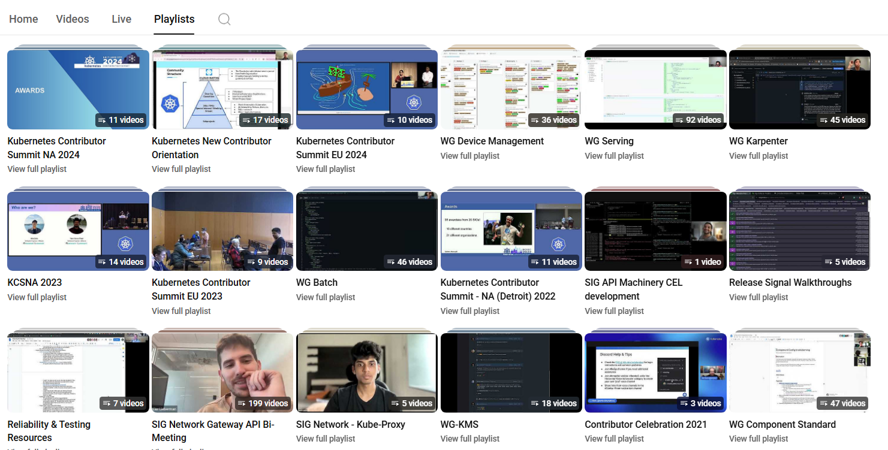
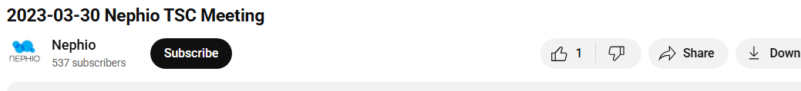
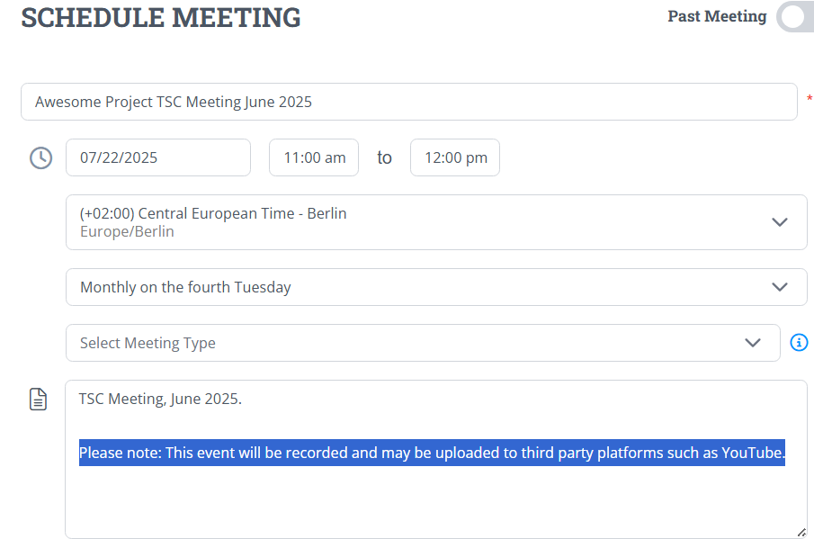

# YouTube Channel Guidelines

YouTube serves as the primary method of distributing video content of NeoNephos, its technical projects, events or affiliated content.

> [!IMPORTANT]  
> Please ensure you always follow the [NeoNephos Code of Conduct](https://github.com/neonephos/.github).

## What To Upload On YouTube

Videos uploaded to YouTube are generally created for a public audience. This includes:

* Public council meetings such as of the [Technical Steering Committee](../Technical_Steering_Committee/Technical_Steering_Committee_Explanation.md).
* Videos produced in events.
* Technical overviews and tutorials.
* General promotional material.

> [!IMPORTANT]  
> All individuals appearing in a video uploaded to a third-party platform (e.g., YouTube) are deemed to have provided consent by having read and accepted the applicable disclaimer. For an example of how this is handled in Zoom calls, see [here](#zoom-recording-prompt-disclaimer).

## Channel Settings

Any YouTube Channel created should adhere to a few basic settings.

### Structure



Ensure that the YouTube channel has an appropriately subdivided structure with thematic playlists, such as:

* Committee Meetings
* Review Meetings
* Outreach Events
* Demos and tutorials

### Roles

Ensure [role based access](https://support.google.com/youtube/answer/4525580?hl=en) to the YouTube channel.

### Description

- If a technical project channel:
  - The channel description must include a link to the NeoNephos website.
  - The channel must add NeoNephos as [a featured channel](https://www.creatorhandbook.net/how-to-feature-channels-on-youtube/).
    
## Video Settings

In order to provide a cohesive and standardized experience for all NeoNephos content, the establishment of some technical commonialities is *recommended*.

> [!NOTE]  
> As recordings of the videos might originate from other platforms such as Zoom Workplace or Microsoft Teams prior to being uploaded on YouTube, it may not be feasible to uphold all technical recommendations in this subchapter.

### Frames per Second

Any uploaded video should run at a frame rate between 24 and 60 fps.

### Dimensions

The aspect ratio should be 16:9 and the resolution at least 1920 x 1080.

### Trim

The video should be trimmed to exclude any dead-space such as waiting periods, as commonly seen in committee meetings.

### Format

It is fine for the video to be uploaded from a compressed format such as .mp4.

## Video Do's And Don'ts

### Don'ts

> [!CAUTION]
> Failure to adhere to these guidelines may result in the NeoNephos YouTube channel receiving a strike, being suspended, or facing other penalties.

#### Unlicensed Music

Do not feature unlicensed music at any point in time. 

> [!TIP]
> When uploading recordings of events, it may appear impossible to upload certain sections without muting the sound. If in doubt, contact the Outreach Committee for advise.

#### Infringe Copyright

Do not infringe upon other users' copyright. While [fair use allows to use copyrighted material without permission from the copyright holder under certain circumstances](https://support.google.com/youtube/answer/9783148?hl=en), contact the Outreach Committee for advise if in doubt.

#### Offensive Content

Obviously nefarious content is already prohibited by our [Code of Conduct](https://neonephos.org/.github). Due to the sensitive, often political, nature of discussions related to digital sovereignty, there are also a lot of subtle things to consider, such as:

* **Remain welcoming for all.** Digital sovereignty is a matter concerning us all. Do not promote political ideologies (e.g. BuyEU).
* **No unnuanced political discussion.** Only discuss political events and laws as related to the cloud-native space.
* **No promotion.** Do not promote services, companies or initiatives if they are unrelated to NeoNephos.

> [!TIP]
> When recording a meeting featuring a chat log such as a community call, review the messages for offensive content prior to upload on YouTube.

#### Do Not Ask For Donations

Do not ask for donations except if approved by the Governing Board.

#### Do Not Beg For Likes Or Followers

Do not beg to your audience to like or follow a video. A subtle appeal to subcribe is no problem, but begging or making follow-up content contingent on likes or audience interaction is not what we stand for.

#### No Wrong Thumbnails

In YouTube, it is very common to see spectacular, attention grabbing thumbnails for videos with a completely different content. Thumbnails should always relate to the video.

#### No Unoriginal, AI Generated Content

Do not upload low-effort, purely AI generated videos, i.e. AI slop.

#### Don't Delete Videos

Do not delete established videos without notification to the Outreach Committee as that may break links.

### Do's

#### Meaningful Video Titles



Videos must have meaningful titles. For some types of videos, here are some naming recommendations:

| Type of Video  | Naming Type | Example |
| ------------- | ------------- | ------------- |
| Technical Steering Committee  | ```ProjectName``` TSC Meeting — ```RecordingDate``` | ORD TSC Meeting — July 2025 |
| Community Call  | ```ProjectName``` Community Call — ```RecordingDate```  | NeoNephos Community Call — August 2025|
| Tutorial  | ```SoftwareName``` <TutorialTopic> Tutorial  | ControllerNinja Bootstrap Tutorial |

#### Meaningful Descriptions

Videos must have meaningful descriptions, summarizing what is showcased and where additional information can be obtained.

#### Subtitles

To ensure accessibility for hearing impaired users, you should add subtitles to any video featuring spoken content. The standard caption language is English.

#### Monitor For Comments & Interaction

After your video has been uploaded, you should monitor it for comments. Engage with the community by contributing to the discourse. 

#### Nondistraction Background

Ensure that your background is clear, tidy and nondistracting. Use a blur in case you are unsure.

#### Visibility

Videos uploaded onto YouTube are generally intended for a public audience. Therefore, the visibility of uploaded videos should always be public.

## Dates

Dates in YouTube descriptions, titles etc. must be in ```YYYYMMDD``` format.

## Recording Disclaimer

Every participant in a video must have consentent to his participation being uploaded to third party platforms such as YouTube. Mere presence is sufficient for participation and the need for obtaining consent.

Obtaining this consent is done either explicitly through e.g. the signing of an agreement or implicitly through e.g. a disclaimer.

The following subsections describe the appropriate procedure for each case.

> [!IMPORTANT]  
> All provided disclaimers have been reviewed, approved by legal and are aligned with the Linux Foundation Europe. No modifications are permitted without explicit approval by the Outreach Committee. They must be used verbatim across all NeoNephos-hosted calls and meetings that are recorded and uploaded to third-party platforms such as YouTube.

### Hosted Calls

*Hosted call is being understood as a call featuring a primary moderator.*

Examples of hosted calls are community calls or committee meetings. The host of such a call is responsible for obtaining the permission of all participants to be featured on YouTube.

#### Zoom Recording Prompt Disclaimer

When using Zoom, the recording disclaimer must appear when joining a recorded call. [This prompt can be customized in some Zoom plans](https://support.zoom.com/hc/en/article?id=zm_kb&sysparm_article=KB0068228).

> **Standard disclaimer (Mandatory)**
> 
> This meeting is being recorded and may be uploaded to third-party platforms such as YouTube. If you do not agree to be featured in this recording, please leave the meeting.

When using Zoom via LFX Project Control Center, appropriate disclaimers have already been added.

#### Meeting Description Disclaimer



Any description, invite or shared link of a meeting should feature a disclaimer that it is being recorded and uploaded to YouTube.

> **Standard disclaimer (Mandatory)**
> 
> This meeting is being recorded and potentially uploaded to third parties such as YouTube.

> [!IMPORTANT]  
> If a user retroactively demands a video to be taken down or modified due to the user's presence, immediately contact the Outreach Committee.

### Events

Events potentially feature a large number of people. Each event is unique in its requirements, therefore contact the Outreach Committee to get guidelines for your event.
