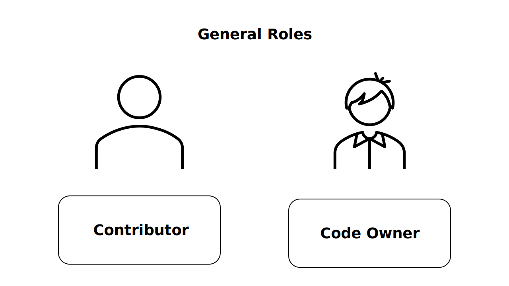

# Technical Steering Committee

NeoNephos' agenda is advanced by the [membership driven organisational governance through the Governing Board (GB)](../governing_board/governing_board_introduction.md)
and the open access technical governance through the [Technical Advisory Council (TAC)](../technical_advisory_council/technical_advisory_council_introduction.md).

The Technical Steering Committee (TSC) represents the governance of a specific technical project embedded within the foundation. The TSC ensures the project adheres to the NeoNephos vision and acts as an interface between the project and the foundation.

The specific responsibilities are set in the charter of the technical project, but they include

- Technical oversight of the project.
- Liaison between the project and the TAC.
- Requesting foundational resources like infrastructure, event planning support or funding.
- Establishing community norms.

## General Roles

Anyone can contribute to NeoNephos' projects. In order to establish an effective governance structure, it makes sense to further subdivide the project participants: Contributor and Code Owner.

### Contributor

A Contributor is anyone who contributes to the project. The contributions can be in the form of code, documents, media or any other form of data.

### Code Owner

A Code Owner is a privileged contributor who can approve pull requests and generally has the authority to commit data to the repository. Some may also call this role Maintainer. The Code Owner role may be repository-scoped.
An individual could have a Contributor role in one repository and a Code Owner role in another.

## How the general roles relate to the TSC

Members of the Technical Steering Committee are usually a subset of the Code Owners. But projects are free to redefine roles as they see fit as usually laid out in section 2.g of the charter of the technical project. Individuals become TSC Members by majority vote of the other TSC Members.

## Where to find the Project's TSC Members?

TSC members of a project are usually found on a dedicated website or in a CONTRIBUTING (or similar) file in the main repository of the project.

## TSC Roles

The TSC members may subdivide themselves again into different roles to better organize the proceedings. It is up to the TSC to decide on the existence and responsibilities of new roles.
However, a Chairperson is, next to normal members, the minimum additional TSC role mentioned in the standard charter for NeoNephos projects:

### Chairperson

The TSC annually elects a chairperson who is the public figurehead of the project. The chairperson leads meetings, sets the agenda and is the liaison between the technical project and NeoNephos. This means the chair also attends TAC meetings and has a voting right in the TAC.

## Meetings

As the technical projects are managed by the community, NeoNephos imposes no hard rules on the frequency of meetings. The TSC decides if it intends to have its meetings open or closed and if meeting recording or minutes are provided to the public.

If votes are being conducted in a meeting, the chair should ensure that the software used to conduct the vote satisfies transparency requirements (who votes) and immutability requirements (votes cannot be changed). Usage of [LFX Voting tools](https://docs.linuxfoundation.org/lfx/project-control-center/v2-latest-version/collaborations/voting) is encouraged.

## Further Reading

Learn more about the TSCs of the various projects by visiting their GitHub presence.
